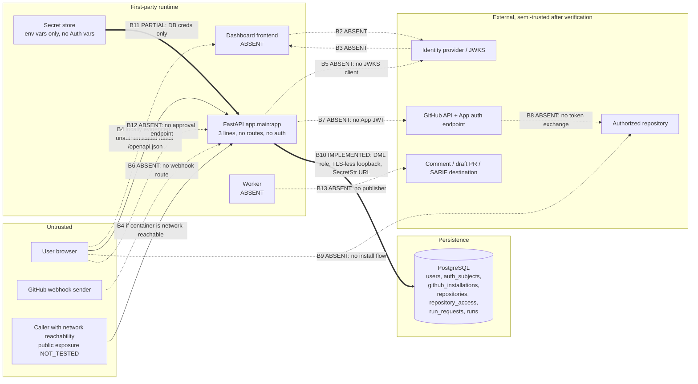

# AUTH-001 — Authentication and Trust-Boundary Audit

## 1. Audit metadata and exact repository baseline

| Field | Value |
|---|---|
| Parent task | `AUTH-001` — Authentication and trust-boundary audit |
| Continuation | `AUTH-001-C2` — Task-graph reconciliation |
| Previous continuation | `AUTH-001-C1` — Audit reconciliation |
| Agent 2 | `A2-AUTH` |
| Agent 3 | `A3-AUTH` |
| Prompt type | `CONTINUATION` |
| Scope | `DOCUMENTATION_ONLY_TASK_GRAPH_RECONCILIATION` |
| Date | 2026-08-02 |
| Worktree | `/Users/omkar/Documents/TestGap-Miner-wt-auth-001` |
| Branch | `agent2/auth-001-audit` |
| Starting commit | `1511f474ee301651b631c8adfe406aeb775327aa` |
| Current relation to `origin/main` | `HEAD` is behind by four non-Auth documentation commits; see §1.1 |
| Contract audited against | `CONTRACT-AUTH-001@1.0.0-draft.2` |
| Result | `PASS / VERIFIED_COMPLETE / A2_AUTH_ACCEPTED` |

Pre-flight commands and results:

```
$ pwd
/Users/omkar/Documents/TestGap-Miner-wt-auth-001
$ git rev-parse --show-toplevel
/Users/omkar/Documents/TestGap-Miner-wt-auth-001
$ git branch --show-current
agent2/auth-001-audit
$ git rev-parse HEAD
1511f474ee301651b631c8adfe406aeb775327aa
$ git status --short --branch
## agent2/auth-001-audit...origin/main [behind 4]
 M docs/components/auth/COMPONENT_STATUS.md
 M docs/components/auth/DECISION_LOG.md
 M docs/components/auth/DEPENDENCY_REQUESTS.md
 M docs/components/auth/LATEST_AGENT3_HANDOFF.md
 M docs/components/auth/OPEN_ISSUES.md
 M docs/components/auth/TASK_LEDGER.md
?? auth-001-audit-review.zip
?? auth-001-c1-review.zip
?? docs/components/auth/AUTH-001_AUDIT.md
$ git status --short --untracked-files=no
(the same six tracked Auth modifications; the new audit remains untracked)
$ git fetch origin
(exit 0)
$ git diff --name-only HEAD..origin/main -- docs/components/auth
(no output)
```

`ENVIRONMENT_BLOCKED` conditions were all evaluated and none applied.

### 1.1 `origin/main` advanced during the audit

At continuation pre-flight, `git status --short --branch` reported
`## agent2/auth-001-audit...origin/main [behind 4]`. The four commits are:

```
$ git log --oneline --decorate HEAD..origin/main
d13e281 (origin/main, origin/HEAD, main) Merge pull request #15 from 01fe25bec239-collab/agent2/integration-db002-record-reconcile
095d8a0 docs(integration): reconcile merged DB-002 state
602fe45 Merge pull request #14 from 01fe25bec239-collab/agent2/database
c914f8b docs(database): reconcile DB-002 prerequisite records

$ git diff --name-only HEAD..origin/main -- docs/components/auth
(no output)
```

They are Database- and Integration-owned documentation changes. **No Auth file
was touched**, so no concurrent modification of Auth records occurred and no
`SPECIFICATION_CONFLICT` condition was triggered.

PR #14 reconciles Database's DB-002 durable records and PR #15 reconciles the
corresponding Integration records. The twelve changed files are confined to
`docs/components/database/**` and `docs/components/integration/**`; every
DB-002 and contract fact cited here remains correct.

This audit was **not** rebased or merged onto the new tip, because `AUTH-001`
requires the baseline to stay exactly
`1511f474ee301651b631c8adfe406aeb775327aa` and authorizes no commit, push, or
merge. All findings below describe that commit.

This audit is documentation. It creates no Auth implementation, no tests, and
no configuration. `ASSUMED`: nothing in this document is a claim of runtime
behavior unless a named repository file or a recorded command result supports
it.

## 2. Files and areas inspected

### 2.1 Enumeration commands

```
$ git ls-files | sort
$ git grep -n -I -E 'auth|oauth|jwt|jwks|issuer|audience|session|cookie|csrf|cors|github app|installation token|webhook|X-Hub-Signature-256|authorization|permission' \
    -- ':!apps/api/.venv/**' ':!.venv/**' ':!node_modules/**' ':!apps/api/uv.lock'
$ find . -type d -name web -not -path "*/.venv/*" -not -path "*/node_modules/*"
$ git ls-files | grep -i -E "auth|jwt|oauth|webhook|github|session|token"
```

The whole repository is 82 tracked files. Every one was enumerated; the files
below were opened and read in full unless marked otherwise. Vendored and
generated trees (`apps/api/.venv/**`, `node_modules/**`, build and coverage
outputs) were excluded from all searches and are not treated as first-party
implementation.

### 2.2 Auth records and contracts (read in full)

- `docs/components/auth/CONTRACT-AUTH-001.md`
- `docs/components/auth/COMPONENT_STATUS.md`
- `docs/components/auth/TASK_LEDGER.md`
- `docs/components/auth/OPEN_ISSUES.md`
- `docs/components/auth/DECISION_LOG.md`
- `docs/components/auth/DEPENDENCY_REQUESTS.md`
- `docs/components/auth/LATEST_AGENT3_HANDOFF.md`

### 2.3 Identity persistence (read in full)

- `apps/api/app/db/models/auth.py`
- `apps/api/app/db/models/workflow.py` (Auth-relevant sections)
- `apps/api/app/db/models/__init__.py`
- `apps/api/app/db/base.py`, `metadata.py`, `config.py`, `engine.py`,
  `session.py`, `dependencies.py`
- `apps/api/alembic/env.py`
- `apps/api/alembic/versions/ad3f80907336_create_db_002_core_entities.py`
  (header and `github_installations` block read; remaining tables verified by
  the executed migration and test run in §8)
- `apps/api/alembic/versions/.gitkeep`, `apps/api/alembic.ini`,
  `apps/api/alembic/script.py.mako`
- `docs/data/database-schema.md`, `docs/data/database-scaffold.md` (searched)

### 2.4 API and application boundaries (read in full)

- `apps/api/app/main.py`
- `apps/api/app/settings.py`
- `apps/api/app/__init__.py`, `apps/api/app/db/__init__.py`

No API route module, request dependency for identity, middleware, error
envelope, startup/shutdown hook, or worker entrypoint exists in the
repository.

### 2.5 Frontend

`find . -type d -name web` returned no result. `ls apps/` returned exactly
`api`. There is no `apps/web`, no frontend manifest, and no frontend lockfile.

`EVIDENCE`: the dashboard frontend does not exist in this repository. Nothing
in this audit assumes one.

### 2.6 GitHub integration

Searched for a GitHub App manifest, app-ID handling, private-key handling,
installation-token exchange, an installation-token cache, installation or
repository permission checks, webhook routes, raw-body handling,
`X-Hub-Signature-256` verification, and delivery-GUID handling.

`git grep` for `webhook`, `installation token`, and `X-Hub-Signature-256` over
first-party paths returned zero hits outside documentation. The only
first-party GitHub artefacts are identity *records*
(`github_installations`, `repositories` in `apps/api/app/db/models/auth.py`)
and the CI workflow file. No GitHub App manifest exists.

### 2.7 Deployment and environment (read in full)

- `docs/components/deployment/CONTRACT-DEPLOY-001.md` (23 lines; scope is the
  database runtime boundary only — zero Auth-relevant content, confirmed by a
  case-insensitive grep for `auth|oauth|jwt|callback|domain|tls|secret|github|webhook|cors` returning no match)
- `docs/components/deployment/ENVIRONMENT_VARIABLES.md`
- `.env.example`
- `compose.yml`
- `Dockerfile`
- `docker/postgres/init/10-create-test-database.sh`
- `.github/workflows/deployment.yml`
- `scripts/deploy/migrate.sh`, `scripts/deploy/local-reset.sh`
- `.gitignore`, `README.md`

`infra/` does not exist. No secret value is reproduced anywhere in this audit;
only variable names appear.

### 2.8 Dependencies and tests (read in full)

- `apps/api/pyproject.toml`
- `apps/api/uv.lock` (excluded from grep as a generated lockfile; dependency
  set read from the manifest)
- `tests/conftest.py`
- `tests/api/test_main.py`, `tests/api/test_settings.py`
- `tests/database/conftest.py`, `support.py`, `test_auth_constraints.py`,
  `test_workflow_constraints.py`, `test_schema.py`, `test_alembic.py`,
  `test_config.py`, `test_connectivity.py`, `test_migration_cycle.py`,
  `test_scaffold.py`

`tests/auth/` does not exist (`ls -d tests/auth` → `No such file or
directory`). `tests/` contains exactly `api/`, `database/`, and
`conftest.py`.

### 2.9 Cross-component records consulted (not modified)

- `docs/components/database/COMPONENT_STATUS.md`, `TASK_LEDGER.md`,
  `DECISION_LOG.md`, `DEPENDENCY_REQUESTS.md`, `OPEN_ISSUES.md`,
  `LATEST_AGENT3_HANDOFF.md`
- `docs/components/agent-workflow/CONTRACT-WORKFLOW-001.md`
- `docs/components/integration/*`
- `docs/specifications/00_AGENT1_DECOMPOSITION_AND_INDEX(1).md`

## 3. Current-state inventory

Classification is per the required vocabulary. A row is
`VERIFIED_COMPLETE` only where first-party repository implementation **and**
executed supporting evidence both exist.

| # | Auth area | Classification | Evidence |
|---|---|---|---|
| 1 | Dashboard human sign-in | `NOT_STARTED` | No `apps/web`; no login route, page, or handler anywhere in `git ls-files`. |
| 2 | Browser session handling | `NOT_STARTED` | No cookie, session store, or session middleware in first-party code. `git grep` for `session` hits only SQLAlchemy DB sessions (`apps/api/app/db/session.py`, `dependencies.py`). |
| 3 | OAuth callbacks | `NOT_STARTED` | No OAuth client, callback route, state parameter, PKCE, or redirect allowlist. `git grep -i oauth` hits documentation only. |
| 4 | Backend JWT validation | `NOT_STARTED` | No JWT decode, JWKS fetch, issuer check, or audience check. No JWT/JWKS/crypto dependency in `apps/api/pyproject.toml`. |
| 5 | Authenticated user context | `NOT_STARTED` | `apps/api/app/main.py` is three lines and declares no dependency, no route, and no request-scoped principal. |
| 6 | GitHub App machine authentication | `NOT_STARTED` | No app-ID handling, no private-key loading, no App JWT construction. |
| 7 | GitHub App installation-token handling | `NOT_STARTED` | No token exchange, no cache, no expiry logic. `github_installations` stores identity only, by contract design. |
| 8 | GitHub App permission configuration | `NOT_STARTED` | No GitHub App manifest exists in the repository. |
| 9 | GitHub webhook authenticity | `NOT_STARTED` | No webhook route, no raw-body capture, no `X-Hub-Signature-256` verification, no delivery-GUID handling. |
| 10 | Repository-scoped authorization | `PARTIAL` | Persistence of the exact `user + installation + repository` tuple is `VERIFIED_COMPLETE` (`apps/api/app/db/models/auth.py:165-234`; 21 passing tests). Runtime enforcement is `NOT_STARTED` — no code reads a grant to allow or deny a request. |
| 11 | Human approval and publication boundaries | `PARTIAL` | Semantics are defined in `CONTRACT-AUTH-001` (`PUBLICATION_REQUEST`/`PUBLICATION_EXECUTE`, no merge grant) and `CONTRACT-WORKFLOW-001` (`AWAITING_HUMAN_REVIEW`, "automation MUST NOT approve or merge its own output"). Persistence exists only as `runs.terminal_actor_type`/`terminal_actor_id` and the run state machine. No enforcement code and no publication actor record exist. |
| 12a | Secret handling | `PARTIAL` | `apps/api/app/settings.py` wraps `DATABASE_URL` in `SecretStr` with redaction proven by `tests/api/test_settings.py`. `.gitignore` excludes `.env*`, `*.pem`, `*.key`, `secrets/`. No Auth secret is defined, injected, or handled anywhere. |
| 12b | CORS | `NOT_STARTED` | No `CORSMiddleware`. FastAPI's default emits no CORS headers, which is the restrictive default. |
| 12c | CSRF | `NOT_STARTED` | No CSRF token, double-submit cookie, or `SameSite` policy — none is reachable because no cookie or state-changing route exists. |
| 12d | Cookies | `NOT_STARTED` | No cookie is ever set or read. |
| 12e | Callback allowlists | `NOT_STARTED` | No redirect-URI allowlist; no callback exists to constrain. |
| 13 | Auth logs, audit events, redaction | `NOT_STARTED` | No logging configuration of any kind in `apps/api/app/**`. No security-event emitter. Redaction exists only for the database URL (12a). Blocked on `AUTH-DEP-005`. |
| 14 | Auth deployment configuration | `NOT_STARTED` | `docs/components/deployment/ENVIRONMENT_VARIABLES.md` registers eleven variables, all PostgreSQL/runtime-guard. Zero Auth variables. `CONTRACT-DEPLOY-001` has no Auth scope. |
| 15 | Auth tests and CI validation | `NOT_STARTED` | `tests/auth/` does not exist. `.github/workflows/deployment.yml` runs the full suite but has no Auth-specific gate. |
| 16 | Auth identity persistence (Database-owned) | `VERIFIED_COMPLETE` | Five contract records implemented as `users`, `auth_subjects`, `github_installations`, `repositories`, `repository_access`; merged via PR #12/#13; 21 Auth constraint tests executed and passing in this audit (§8). |
| 17 | `CONTRACT-AUTH-001` publication | `VERIFIED_COMPLETE` | `1.0.0-draft.2` exists and is recorded `ACKNOWLEDGED_AND_MERGED` by A2-DATABASE (`docs/components/database/COMPONENT_STATUS.md:17-19`, `DECISION_LOG.md:20`). |

`IMPLEMENTED`: areas 16 and 17, plus the `DATABASE_URL` redaction in 12a.
`NOT_STARTED`: every other Auth runtime area.
`ASSUMED`: nothing. Each row above cites a file or an executed command.

### 3.1 Explicit non-finding

No first-party Auth runtime module exists anywhere in the repository. The only
files whose names contain an Auth term are
`apps/api/app/db/models/auth.py` (Database-owned persistence),
`tests/database/test_auth_constraints.py` (Database-owned schema tests), and
the seven Auth documentation records. Third-party package source under
`apps/api/.venv/**` was excluded and is **not** counted as TestGap Miner Auth
implementation.

## 4. Trust-boundary diagram



Solid edges are implemented and evidenced. Dashed edges are boundaries the
design requires that have no first-party implementation at this baseline.

`B4` is the only currently implemented inbound application boundary. In a
running and network-reachable container, a caller can reach FastAPI's default
documentation/OpenAPI surface without credentials. Actual public or
production deployment exposure is `NOT_TESTED` (§10, `AUTH-RISK-004`).

## 5. Trust-boundary table

| ID | Boundary | Trusted side | Untrusted side | Credential / assertion crossing | Validation required | Evidenced implementation | Missing control | Owner | Risk |
|---|---|---|---|---|---|---|---|---|---|
| B1 | User browser → dashboard frontend | Frontend origin | Browser, user input | Session cookie or bearer token | Origin isolation, `Secure`/`HttpOnly`/`SameSite` cookie flags, CSRF defence, XSS-safe rendering | `NOT_STARTED` — no `apps/web` | Entire browser session boundary | A2-UI + A2-AUTH | `HIGH` (absent feature) |
| B2 | Frontend → identity provider | Frontend | IdP redirect target | Client ID, `state`, PKCE challenge, requested scopes | Registered client, per-request `state`, PKCE, exact redirect URI | `NOT_STARTED` | OAuth client entirely | A2-AUTH (`AUTH-002`) | `HIGH` (absent feature) |
| B3 | IdP callback → frontend/backend | Callback handler | Callback query string, attacker-supplied | Authorization code, `state` | `state` match, single-use code, exact-match redirect allowlist, code never persisted | `NOT_STARTED` | Callback allowlist and `state` verification | A2-AUTH (`AUTH-002`) | `HIGH` (absent feature) |
| B4 | Browser/frontend → FastAPI | API process | Caller with network reachability; public/production exposure `NOT_TESTED` | `Authorization` header or cookie | Bearer validation, deny-by-default routing, CORS policy, error envelope without leakage | `PARTIAL` — app exists (`apps/api/app/main.py:3`), Uvicorn binds `0.0.0.0` in a running container (`Dockerfile:17`), and local `TestClient` evidence proves `/openapi.json` is unauthenticated (`tests/api/test_main.py:4-8`); no auth of any kind | Authentication dependency, deny-by-default, docs-surface control | A2-AUTH + A2-BACKEND (`AUTH-003`) | `LOW` at the empty-route baseline; potentially `CRITICAL` if a protected route is added without `AUTH-003` |
| B5 | FastAPI → JWT issuer / JWKS | API process | Remote JWKS document | Signed JWT; JWKS public keys | Signature verification, exact `iss`, exact `aud`, `exp`/`nbf`, `alg` allowlist, `kid` rotation, cached JWKS with bounded TTL | `NOT_STARTED` — no JWT/JWKS dependency in `apps/api/pyproject.toml` | All token validation | A2-AUTH (`AUTH-003`) | `HIGH` (absent feature) |
| B6 | GitHub webhook sender → webhook endpoint | API process | Any caller claiming to be GitHub | `X-Hub-Signature-256`, `X-GitHub-Delivery`, raw body | Constant-time HMAC-SHA256 over the **raw** body before parsing, expose delivery GUID and repository identity, payload size cap; downstream durable idempotency before business processing | `NOT_STARTED` — no webhook route exists; deployment exposure `NOT_TESTED` | Signature verification (`AUTH-005`) and downstream replay defence | A2-AUTH (`AUTH-005`) + A2-BACKEND; future Workflow/Database integration owner unresolved | `HIGH` (absent feature) |
| B7 | API/worker → GitHub App auth endpoint | Runtime service | GitHub API | RS256 App JWT signed with the App private key | Short `exp` (≤10 min), key never logged or persisted, clock-skew tolerance | `NOT_STARTED` | App JWT creation and private-key custody | A2-AUTH (`AUTH-004`) | `HIGH` (absent feature) |
| B8 | GitHub App installation → authorized repository | Runtime service | GitHub-side authorization | Installation access token | Installation scoping, least-privilege permissions, ≤1 h token lifetime, no token persistence | `NOT_STARTED`; contract already forbids storing tokens (`CONTRACT-AUTH-001` §Secret and credential boundary) and the schema stores none (verified in §8) | Token acquisition, caching, expiry, repository scoping | A2-AUTH (`AUTH-004`) | `HIGH` (absent feature) |
| B9 | Human user → installation → repository access grant | Grant persistence | Human-driven GitHub install flow | GitHub-verified installation and repository selection | `authorization_source = GITHUB_VERIFIED`, exact tuple, deny-by-default, revalidation freshness | `PARTIAL` — `repository_access` persists the exact tuple with a partial unique index over `status = 'ACTIVE'` (`apps/api/app/db/models/auth.py:176-183`) and distinguishes revocation from expiry; **no code creates, verifies, or reads grants** | Grant synchronisation from GitHub, freshness policy (`AUTH-ISSUE-006`) | A2-AUTH (`AUTH-006`) | `MEDIUM` (persisted, unenforced) |
| B10 | API/worker → PostgreSQL identity records | API process | Database credentials in transit | `DATABASE_URL` (DML role `testgap_app`) | Least-privilege role, no DDL from the app, credential redaction, no secret columns | `IMPLEMENTED` and `TESTED` — role separation in `docker/postgres/init/10-create-test-database.sh:31-72`; `SecretStr` redaction in `apps/api/app/settings.py:11-28` proven by `tests/api/test_settings.py:20-33`; migration role separated via `resolve_migration_database_url` (`apps/api/app/db/config.py:59-69`) | TLS to PostgreSQL is unspecified for non-local deployment | A2-DEPLOYMENT | `INFORMATIONAL` |
| B11 | Runtime service → secret-management boundary | Process env | Secret store | Env-injected values | No secret in VCS, no secret in logs or errors, named registry | `PARTIAL` — `.gitignore:2-7` excludes `.env*`, `*.pem`, `*.key`, `secrets/`; `ENVIRONMENT_VARIABLES.md` registers eleven **database-only** variables; `.env.example` holds placeholders only | Every Auth secret name (IdP client secret, GitHub App private key, webhook secret, JWT/session key) is unregistered | A2-DEPLOYMENT (`AUTH-DEP-004`, `AUTH-DEP-009`) | `MEDIUM` (dependency gap) |
| B12 | Human approval → publication request | API process | Human decision input | Authenticated human identity + `HUMAN_DECISION_WRITE` / `PUBLICATION_REQUEST` | Human actor required, machine actor rejected, decision attributable and immutable | `NOT_STARTED` for enforcement. Contract semantics exist; `runs.terminal_actor_type` is constrained to `SYSTEM`, `WORKFLOW`, `WORKER`, `HUMAN` (`apps/api/app/db/models/workflow.py:129`) | Approval endpoint, human-actor assertion, decision record (deferred to DB-005) | A2-AUTH + A2-AGENT-WORKFLOW | `MEDIUM` (absent feature with a named persistence gap) |
| B13 | Publication worker → comment / draft PR / SARIF destination | Worker | GitHub write surface | Installation access token, `PUBLICATION_EXECUTE` | Machine attribution, traceable authorized trigger, draft/comment only, no merge or approval | `NOT_STARTED` — no worker, no publisher, no machine-actor record | Publication executor and its actor record | A2-AUTH (`AUTH-006`) + A2-AGENT-WORKFLOW; `AUTH-008` final acceptance | `HIGH` (absent feature) |

All thirteen required boundaries are mapped. `ASSUMED`: the design intent for
each absent boundary is taken from `CONTRACT-AUTH-001@1.0.0-draft.2` and
`CONTRACT-WORKFLOW-001@1.0.0-draft.1`; no behavior is inferred from a
dependency package.

## 6. Auth-path matrix

`Impl.` is first-party implementation evidence. `Test` is executed test
evidence. Absence of a row's implementation is recorded as `NOT_STARTED`, not
as a vulnerability.

| # | Path | Expected design | Implementation evidence | Test evidence | Classification | Missing dependency | Owning task |
|---|---|---|---|---|---|---|---|
| 1 | Dashboard login | Redirect to IdP with `state` + PKCE; on callback exchange code, establish session, resolve `(issuer, subject)` → canonical user, require `status = ACTIVE` | None | None | `NOT_STARTED` | IdP metadata (`AUTH-DEP-004`); frontend owner (`AUTH-DEP-010`) | `AUTH-002` |
| 2 | Dashboard logout | Invalidate server session, clear cookie, optionally IdP end-session | None | None | `NOT_STARTED` | Session model from `AUTH-002` | `AUTH-002` |
| 3 | Session refresh | Refresh without re-consent; never persist provider refresh tokens (`CONTRACT-AUTH-001` §External authentication subject) | None | None | `NOT_STARTED` | `AUTH-DEP-004` | `AUTH-002` |
| 4 | Expired session | Deny; return an unauthenticated envelope; no silent renewal | None | None | `NOT_STARTED` | Session semantics (`AUTH-002`); future Backend error-envelope integration (`AUTH-DEP-006`, `AUTH-003`) | `AUTH-002` / `AUTH-003` |
| 5 | Malformed JWT | Reject before any claim is trusted; no parse-then-verify | None — no JWT library in `apps/api/pyproject.toml:6-13` | None | `NOT_STARTED` | JWT/JWKS dependency (`AUTH-DEP-006`) | `AUTH-003` |
| 6 | Wrong issuer | Reject on exact, case-sensitive `iss` mismatch (`CONTRACT-AUTH-001` §External authentication subject; `AUTH-DEC-011`) | Storage semantics only: `issuer` is `sa.Text`, exact bytes, default collation, no normalization (`apps/api/app/db/models/auth.py:70-84`) | `tests/database/test_auth_constraints.py::test_case_distinct_issuer_and_subject_are_separate_identities`, `::test_issuer_and_subject_are_stored_without_normalization` — 2 passing | `PARTIAL` (storage `VERIFIED_COMPLETE`, runtime check `NOT_STARTED`) | Canonical issuer value (`AUTH-DEP-004`) | `AUTH-003` |
| 7 | Wrong audience | Reject on exact `aud` mismatch | None | None | `NOT_STARTED` | Audience value (`AUTH-DEP-004`) | `AUTH-003` |
| 8 | JWKS rotation | Cache JWKS with bounded TTL; refetch on unknown `kid`; bound refetch rate | None | None | `NOT_STARTED` | JWKS URL (`AUTH-DEP-004`) | `AUTH-003` |
| 9 | GitHub App JWT creation | RS256 over App ID with short `exp`; private key from the secret store, never persisted or logged | None | None | `NOT_STARTED` | App ID and private-key variable names (`AUTH-DEP-009`) | `AUTH-004` |
| 10 | Installation-token acquisition | Exchange App JWT for an installation token scoped to the installation | None. Contract forbids storing tokens; `github_installations` has no token column | `tests/database/test_schema.py` asserts absence of secret-bearing columns over ORM metadata and reflected columns — passing | `NOT_STARTED` (acquisition); token-exclusion `VERIFIED_COMPLETE` | `AUTH-DEP-009` | `AUTH-004` |
| 11 | Installation-token reuse and expiry | In-memory cache keyed by installation; refresh before expiry; never persisted | None | None | `NOT_STARTED` | `AUTH-DEP-009` | `AUTH-004` |
| 12 | Unauthorized repository access | Deny-by-default; require an active grant for the exact tuple | Grant persistence exists; **no runtime check reads it** | `::test_grant_referencing_an_unknown_repository_is_rejected` — passing (FK-level only) | `PARTIAL` | Authorization dependency (`AUTH-DEP-006`) | `AUTH-006` |
| 13 | Valid webhook signature | Constant-time HMAC-SHA256 over the raw body, before JSON parsing | None — no webhook route | None | `NOT_STARTED` | Webhook secret name (`AUTH-DEP-009`); raw-body route contract (`AUTH-DEP-006`) | `AUTH-005` |
| 14 | Invalid webhook signature | Reject with no side effect and no body echo | None | None | `NOT_STARTED` | as above | `AUTH-005` |
| 15 | Altered webhook body | Signature must fail; body must not be re-serialized before verification | None | None | `NOT_STARTED` | as above | `AUTH-005` |
| 16 | Duplicate delivery GUID | Idempotent: second delivery is recorded and produces no duplicate side effect | None. No delivery-GUID column exists in the DB-002 schema | None | `NOT_STARTED` / `DOWNSTREAM_INTEGRATION_GAP` | Durable idempotency owner unresolved; no new Database model or dependency contract authorized | Future Backend/Workflow/Database integration; required before end-to-end processing and `AUTH-008`, not the `AUTH-005` verifier |
| 17 | Cross-user access | User B's credentials must never reach User A's grant | Exact-tuple grant model | `::test_cross_user_substitution_finds_no_grant` — passing | `PARTIAL` (data model `VERIFIED_COMPLETE`, enforcement `NOT_STARTED`) | `AUTH-DEP-006` | `AUTH-006` |
| 18 | Cross-installation access | Installation B must not authorize Repository A for User A | Exact-tuple grant model | `::test_cross_installation_substitution_finds_no_grant` — passing | `PARTIAL` | `AUTH-DEP-006` | `AUTH-006` |
| 19 | Cross-repository access | Repository B must not be reachable through User A's Repository A grant | Exact-tuple grant model | `::test_cross_repository_substitution_finds_no_grant` — passing | `PARTIAL` | `AUTH-DEP-006` | `AUTH-006` |
| 20 | Publication request | Requires a human actor with `PUBLICATION_REQUEST` on the exact tuple | None. `run_requests.requested_by_subject → auth_subjects.id` exists (`apps/api/app/db/models/workflow.py:205-207`) but carries **no installation reference**, so the exact tuple is not reconstructable from the request row alone | None | `NOT_STARTED` | Installation reference on the request (`AUTH-DEP-007`) | `AUTH-006` |
| 21 | Publication execution | `GITHUB_APP_INSTALLATION` actor, traceable to an authorized request/event/human decision; draft/comment only | None. `TERMINAL_ACTOR_TYPES = ("SYSTEM", "WORKFLOW", "WORKER", "HUMAN")` (`apps/api/app/db/models/workflow.py:129`) has no machine-installation actor value, and no publication-actor record exists | None | `NOT_STARTED` | Machine-actor representation (`AUTH-DEP-008`) | `AUTH-006`; `AUTH-008` final acceptance |
| 22 | Attempted auto-merge or approval bypass | Structurally impossible: no merge scope requested, no merge code path, `PUBLICATION_EXECUTE` never grants merge | Enforced today **only by absence** — no GitHub write code exists at all. `CONTRACT-AUTH-001` §Authentication domains and `CONTRACT-WORKFLOW-001:25-26,375-381` both prohibit it; `README.md:17-18` states draft PRs and comments only | None | `NOT_STARTED` (as a control); currently `ABSENT_BY_CONSTRUCTION` | GitHub App permission manifest with no merge scope (`AUTH-DEP-009`) | `AUTH-004` / `AUTH-007` |

All 22 required paths are present. `TESTED`: paths 6, 12, 17, 18, 19 have
executed test evidence — and that evidence covers **schema constraints only**,
never an authorization decision. `NOT_TESTED`: every other path.

Note the header comment of `tests/database/test_auth_constraints.py:1-7`,
which states this explicitly: *"DB-002 has no Auth runtime, so 'denied' here
means the exact-tuple authorization lookup finds no active grant, never that a
service refused a request. No authorization decision is claimed to be
tested."* This audit adopts that limitation.

## 7. Configuration and secret-name inventory

No secret value appears below. Names only.

### 7.1 Registered variables (all database-scoped)

| Variable | Source | Auth relevance |
|---|---|---|
| `DATABASE_URL` | `.env.example:2`, `ENVIRONMENT_VARIABLES.md:7` | Reaches identity tables; wrapped in `SecretStr` |
| `MIGRATION_DATABASE_URL` | `.env.example:5`, `ENVIRONMENT_VARIABLES.md:8` | DDL role; forbidden to API/workers |
| `TEST_DATABASE_URL` | `.env.example:8`, `ENVIRONMENT_VARIABLES.md:9` | Tests only; must end in `_test` and differ from `DATABASE_URL` (`apps/api/app/db/config.py:34-56`) |
| `TESTGAP_RUNTIME` | `.env.example:11` | Deployment guard; values `local`/`ci` only |
| `POSTGRES_USER`, `POSTGRES_DB`, `POSTGRES_PASSWORD`, `POSTGRES_APP_PASSWORD`, `POSTGRES_MIGRATION_PASSWORD`, `POSTGRES_TEST_PASSWORD`, `POSTGRES_HOST_PORT` | `compose.yml:6-15`, `ENVIRONMENT_VARIABLES.md:11-17` | Local/CI PostgreSQL only |

### 7.2 Auth variables required by the design and **absent** from every registry

`NOT_STARTED` for all of the following. None is defined, referenced, or
documented anywhere in the repository. Names are indicative and are **not** yet
frozen. Ownership is split rather than treated as one configuration blocker:

- `AUTH-DEP-004`: approved human IdP/equivalent, issuer, audience, JWKS/key
  source, authorization/token endpoints, dashboard domain, human OAuth
  callback allowlist, TLS, client-ID/client-secret variable names, and
  secret-injection ownership;
- `AUTH-DEP-009`: GitHub App ID/private-key variable names, webhook-secret
  variable name, webhook endpoint/public URL, applicable App setup and
  installation callback/setup metadata, and least-privilege permissions;
- future Auth design: session/JWT signing-key name, cookie policy, and allowed
  browser origins. These are not reclassified as direct `AUTH-002`
  prerequisites by this audit repair.

### 7.3 Secret-handling controls that do exist

- `apps/api/app/settings.py:11-28` — `SecretStr` + `hide_input_in_errors=True`;
  the psycopg-scheme validator raises without echoing the URL.
- `tests/api/test_settings.py:20-33` — asserts a bad URL's password never
  appears in `str`, `repr`, or `.json()` of the validation error. Passing.
- `.gitignore:2-7` — `.env`, `.env.*` (with `!.env.example`), `*.pem`, `*.key`,
  `secrets/`.
- `docker/postgres/init/10-create-test-database.sh:16-19` — passwords passed via
  `\getenv`, never interpolated into a logged SQL string.
- `CONTRACT-AUTH-001` §Secret and credential boundary — nine forbidden column
  categories, verified absent by `tests/database/test_schema.py`.

### 7.4 CI placeholder values

`.github/workflows/deployment.yml:15-18` contains literal strings such as
`ci-app-placeholder`. These are placeholders for an ephemeral CI PostgreSQL
container that is destroyed in the same job (`deployment.yml:30-31`). They are
not credentials to any real system. Recorded as `INFORMATIONAL`
(`AUTH-RISK-011`), not as a leaked secret.

## 8. Existing test inventory and executed commands

### 8.1 `tests/auth/`

```
$ ls -d tests/auth
ls: tests/auth: No such file or directory
```

**AUTH-SPECIFIC TEST SUITE: `NOT_STARTED` / `NOT_TESTED`.**

The authorized command
`uv run --project apps/api pytest -c apps/api/pyproject.toml tests/auth -q`
was therefore **not run**: its target does not exist.

### 8.2 Tests that do exist and were executed

Each command is justified. Test dependencies were installed exactly as CI does
(`.github/workflows/deployment.yml:23`); no manifest or lockfile changed.

```
$ uv sync --project apps/api --all-groups --locked
… Installed 22 packages (test group)   [no lockfile change]

$ uv run --project apps/api pytest --collect-only -q
174 tests collected      rootdir: /Users/omkar/Documents/TestGap-Miner-wt-auth-001

$ uv run --project apps/api pytest tests/api -q
5 passed, 1 warning in 0.02s
```

Justification for `tests/api` — it is the only test coverage of the FastAPI
application surface, i.e. boundary `B4`, and of `DATABASE_URL` redaction
(`B10`/`B11`).

The database tests skip without a live PostgreSQL
(`tests/database/conftest.py:36-46`):

```
$ uv run --project apps/api pytest tests/database/test_auth_constraints.py -q
21 skipped, 1 warning in 0.01s          [TEST_DATABASE_URL unset]
```

To obtain real rather than skipped evidence for the Auth-owned constraints, an
**isolated, disposable** PostgreSQL was started under a distinct Compose
project name and removed afterwards. No repository file was created or
modified; no existing volume was touched.

```
$ docker compose --project-name testgap-auth001-audit up -d --wait postgres
Container testgap-auth001-audit-postgres-1  Healthy

$ uv run --project apps/api pytest tests/database/test_auth_constraints.py -q
21 passed, 1 warning in 2.22s

$ uv run --project apps/api pytest -q
174 passed, 1 warning in 0.95s

$ docker compose --project-name testgap-auth001-audit down --volumes --remove-orphans
Volume testgap-auth001-audit_postgres-data  Removed
Network testgap-auth001-audit_default       Removed
$ docker ps -a --filter "name=testgap-auth001-audit" --format '{{.Names}}'
(no output)
```

Justification for `tests/database/test_auth_constraints.py` — it is the only
executable evidence for the Auth-owned identity and exact-tuple semantics that
`CONTRACT-AUTH-001` requires. Justification for the full suite — it confirms
the audited baseline is green end-to-end and that no Auth area is silently
red.

### 8.3 Test inventory table

| Suite | Files | Count | Result | What it proves for Auth | What it does **not** prove |
|---|---|---|---|---|---|
| `tests/auth/**` | — | 0 | — | Nothing; absent | Everything Auth-runtime |
| `tests/api` | `test_main.py`, `test_settings.py` | 5 | `PASS` | `/openapi.json` is reachable without credentials; `DATABASE_URL` is redacted in success and failure paths; `Settings` exposes exactly one field | No authentication, authorization, or session behavior |
| `tests/database/test_auth_constraints.py` | 1 | 21 | `PASS` | Exact-tuple grant scoping; case-sensitive un-normalized `issuer`/`subject`; unique `(issuer, subject)`; unique GitHub installation and repository IDs; revocation vs. expiry distinction; at most one `ACTIVE` grant per tuple; re-grant representable; historical attribution retained | **No authorization decision.** No service refused anything; these are schema constraints and SELECT results |
| `tests/database/test_schema.py` | 1 | in suite | `PASS` | No secret-bearing column exists in ORM metadata or the reflected schema | Nothing about runtime secret handling |
| `tests/database/*` (rest) | 7 | to 169 total | `PASS` | Migration reversibility, connectivity, config guards | Nothing Auth-runtime |
| Full suite | all | 174 | `PASS` | Baseline is green | — |

### 8.4 CI validation

`.github/workflows/deployment.yml` runs `uv run --project apps/api pytest`
from the repository root. Collection was verified to be the full 174-test
suite (rootdir is the repository root; `apps/api/pyproject.toml`'s
`testpaths` does not apply from that working directory). CI therefore does
execute the Auth constraint tests — but there is **no Auth-specific CI gate**,
because no Auth-specific test exists. `permissions: contents: read`
(`deployment.yml:7-8`) is correctly least-privilege.

## 9. Contract-alignment assessment

| Contract obligation | Where evidenced | Alignment |
|---|---|---|
| Five conceptual records persisted | `apps/api/app/db/models/auth.py` — `users`, `auth_subjects`, `github_installations`, `repositories`, `repository_access` | `ALIGNED` |
| UUID internal IDs, separate immutable external IDs | `id: Mapped[uuid.UUID]` on all five; `github_installation_id`/`github_account_id`/`github_repository_id` as `BigInteger` with `> 0` checks | `ALIGNED` |
| Exact, case-sensitive `issuer` + opaque `subject`, no normalization | `sa.Text` + `UniqueConstraint("issuer","subject")`, module docstring lines 7-9, 2 passing tests | `ALIGNED` |
| One active `(issuer, subject)` → one canonical user; duplicate linkage rejected | `::test_duplicate_issuer_subject_linkage_to_another_user_is_rejected` — passing | `ALIGNED` |
| Exact `user + installation + repository` tuple; at most one `ACTIVE` | Partial unique index `uq_repository_access_active` over `status = 'ACTIVE'` | `ALIGNED` |
| Expiry distinct from revocation | `expiry_distinct_from_revocation` and `revoked_at_present` check constraints; 4 passing tests | `ALIGNED` |
| Lifecycle statuses deny, history preserved | Status check constraints on all five tables; `::test_historical_inactive_grants_remain_attributable` — passing | `ALIGNED` at the persistence layer; **denial itself is unenforced** (no runtime) |
| No credentials or raw secrets in domain tables | `tests/database/test_schema.py` over ORM metadata and reflected columns | `ALIGNED` |
| No enterprise RBAC / tenancy / billing | Seven tables only; no role, permission, org, or billing table | `ALIGNED` |
| Human and machine identity never conflated | Persistence keeps `users`/`auth_subjects` separate from `github_installations` | `ALIGNED` at rest; no runtime conflation is possible because no runtime exists |
| `PUBLICATION_EXECUTE` uses a `GITHUB_APP_INSTALLATION` actor | No such actor value exists in `TERMINAL_ACTOR_TYPES`; no publication-actor record | `GAP` → `AUTH-ISSUE-013` |
| Human repository action requires the exact tuple | `run_requests` carries `requested_by_subject` and `repository_id` but no installation reference | `GAP` → `AUTH-ISSUE-012` |
| `HUMAN_USER` actor requires `user_id` | `run_requests.requested_by_subject → auth_subjects.id`; the canonical `user_id` is reachable only by join through `auth_subjects.user_id` | `ALIGNED_WITH_NOTE` → `AUTH-ISSUE-014` |
| Contract is documentation, not runtime | `CONTRACT-AUTH-001:309` | `ALIGNED` — confirmed by this audit |

### 9.1 Contract metadata that no longer matches reality

`CONTRACT-AUTH-001.md` metadata (lines 9-12) still records
`Status: DRAFT_FOR_CONSUMER_REVIEW`, `Blocking consumer: A2-DATABASE`, and
`Blocking consumer task: DB-002`. Its closing line 310-311 still says
A2-DATABASE "must acknowledge this draft before treating it as accepted for
DB-002" and that DB-002 "remains blocked on accepted `CONTRACT-WORKFLOW-001`".

Both conditions are now satisfied and merged: A2-DATABASE records
`CONTRACT-AUTH-001@1.0.0-draft.2` as `ACKNOWLEDGED_AND_MERGED`
(`docs/components/database/COMPONENT_STATUS.md:17-19`,
`DECISION_LOG.md:20`, `TASK_LEDGER.md:10-12`) and DB-002 as
`PASS / VERIFIED_COMPLETE / MERGED` via PR #12 / merge commit `3701520`.

`CONTRACT-AUTH-001.md` is a forbidden file for this task and was **not**
modified. Recorded as `AUTH-ISSUE-011` for A2-AUTH.

## 10. Security risks and contradictions

Every risk cites repository evidence. A missing implementation is recorded as
an **absent feature**, not a vulnerability. `AUTH-RISK-004` is the one
`UNSAFE_IF_DEPLOYED_IMPLEMENTED_BEHAVIOR`: the repository proves the runnable
container behavior, but actual public or production exposure is `NOT_TESTED`.

| ID | Finding | Class | Severity | Evidence | Why this severity |
|---|---|---|---|---|---|
| `AUTH-RISK-001` | No human authentication runtime: no sign-in, session, OAuth client, or callback | Absent feature | `HIGH` | No `apps/web`; `apps/api/app/main.py` is 3 lines | Blocks `AUTH-002`/`AUTH-003` entirely. Not exploitable — there is nothing to sign in to |
| `AUTH-RISK-002` | No JWT/JWKS validation and no JWT-capable dependency | Absent feature | `HIGH` | `apps/api/pyproject.toml:6-13` lists alembic, fastapi, pydantic-settings, psycopg, sqlalchemy, uvicorn only | Every authenticated route depends on this |
| `AUTH-RISK-003` | No GitHub App machine authentication, installation-token handling, or App manifest | Absent feature | `HIGH` | Zero first-party hits for `installation token`, App ID, or private-key handling | Blocks `AUTH-004`, publication, and repository sync |
| `AUTH-RISK-004` | A running, network-reachable container serves FastAPI's default docs surface with no authentication, no CORS policy, and no deny-by-default routing; actual public/production exposure is `NOT_TESTED` | **`UNSAFE_IF_DEPLOYED_IMPLEMENTED_BEHAVIOR`** | `LOW` at the current empty-route baseline; potentially `CRITICAL` if a protected route is added without `AUTH-003` | `Dockerfile:17` runs `uvicorn app.main:app --host 0.0.0.0 --port 8000`; `apps/api/app/main.py:3` is bare `FastAPI()`; local `TestClient` evidence at `tests/api/test_main.py:4-8` proves `/openapi.json` returns 200 with no credentials | The repository proves runnable behavior, not a production deployment or internet reachability. The structural risk is opt-in authentication: a protected route added before `AUTH-003` would be unprotected |
| `AUTH-RISK-005` | No webhook endpoint and therefore no `X-Hub-Signature-256` verification, raw-body handling, or delivery-GUID persistence | Absent feature plus downstream integration gap | `HIGH` | No webhook route in `git ls-files`; no delivery-GUID column in the DB-002 schema | No webhook boundary is implemented; deployment exposure is `NOT_TESTED`. `AUTH-DEP-006` and `AUTH-DEP-009` block `AUTH-005`. Durable delivery-GUID storage is downstream integration, not a direct verifier prerequisite, but is required before end-to-end processing and `AUTH-008` acceptance |
| `AUTH-RISK-006` | Exact-tuple repository authorization is persisted but never enforced | Incomplete control | `MEDIUM` | `repository_access` exists and is tested; no first-party code reads a grant | The correct data model exists; the decision point does not. Not exploitable without a runtime |
| `AUTH-RISK-007` | `run_requests` cannot reconstruct the exact `user + installation + repository` tuple: it has `requested_by_subject` and `repository_id` but no installation reference | Dependency gap / contradictory persistence shape | `MEDIUM` | `apps/api/app/db/models/workflow.py:200-207` | `AUTH-006` cannot authorize a run request against the contract tuple from the request row alone. Needs `AUTH-DEP-007` |
| `AUTH-RISK-008` | No persistence can record a `GITHUB_APP_INSTALLATION` actor for `PUBLICATION_EXECUTE` | Dependency gap | `MEDIUM` | `TERMINAL_ACTOR_TYPES = ("SYSTEM","WORKFLOW","WORKER","HUMAN")` at `apps/api/app/db/models/workflow.py:129`; no publication-actor record exists | `CONTRACT-AUTH-001` requires machine attribution traceable to an authorized trigger. `AUTH-DEP-008` blocks `AUTH-006` and `AUTH-008` final acceptance, not `AUTH-004` machine-token implementation |
| `AUTH-RISK-009` | No Auth environment variable is registered anywhere | Dependency gap | `MEDIUM` | `ENVIRONMENT_VARIABLES.md` holds eleven database-only rows; `CONTRACT-DEPLOY-001` has zero Auth scope | Human IdP variables block `AUTH-002`/`AUTH-003` through `AUTH-DEP-004`; GitHub App/webhook variables block `AUTH-004`/`AUTH-005` through `AUTH-DEP-009` |
| `AUTH-RISK-010` | No Auth-specific test suite and no Auth CI gate | Untested behavior | `MEDIUM` | `tests/auth/` absent; `.github/workflows/deployment.yml` has no Auth step | Every future Auth control would ship untested. Database tests must not be counted as Auth coverage |
| `AUTH-RISK-011` | CI workflow contains literal placeholder passwords in plaintext | Deferred non-goal | `INFORMATIONAL` | `.github/workflows/deployment.yml:15-18`; container destroyed at `:30-31` | Ephemeral CI-only PostgreSQL. Not a credential to any real system. Accepted |
| `AUTH-RISK-012` | No Auth logging, audit events, or Auth-specific redaction | Absent feature | `INFORMATIONAL` | No logging configuration anywhere in `apps/api/app/**` | Blocked on `AUTH-DEP-005` (Security guidance). Only the `DATABASE_URL` redaction exists |
| `AUTH-RISK-013` | No CORS, CSRF, cookie, or callback-allowlist policy | Absent feature | `INFORMATIONAL` | No middleware in `apps/api/app/main.py` | FastAPI's default sends **no** CORS headers, which is the restrictive default, and no cookie or state-changing route exists. The real risk is a permissive `CORSMiddleware` being added later; `AUTH-007` must own the origin allowlist |
| `AUTH-RISK-014` | Human attribution on run requests is by `auth_subject_id`, while `CONTRACT-AUTH-001` defines the `HUMAN_USER` actor by `user_id` | Contract-alignment note | `LOW` | `apps/api/app/db/models/workflow.py:205-207` | Resolvable by join through `auth_subjects.user_id`, and it preserves historical attribution when a subject is revoked. Needs an explicit A2-AUTH ruling before `AUTH-006`, not a schema change |
| `AUTH-RISK-015` | `CONTRACT-AUTH-001` metadata contradicts merged repository state | Contradictory contract | `MEDIUM` | Contract lines 9-12 and 310-311 vs. `docs/components/database/COMPONENT_STATUS.md:17-19` and PR #12/#13 | A downstream reader could conclude DB-002 is still blocked. The contract is a forbidden file here; A2-AUTH must revise it |

### 10.1 Contradictions summary

1. `AUTH-RISK-015` — contract metadata vs. merged DB-002 (owner: A2-AUTH).
2. `AUTH-RISK-007` — contract's exact authorization tuple vs. `run_requests`
   shape (owner: A2-AUTH ruling, then A2-DATABASE).
3. `AUTH-RISK-008` — contract's machine publication actor vs. Workflow's
   terminal actor vocabulary (owner: A2-AUTH + A2-AGENT-WORKFLOW).
4. `AUTH-RISK-014` — `HUMAN_USER` keyed by `user_id` vs. subject-keyed request
   attribution (owner: A2-AUTH).
5. Cross-component observation, **not** an Auth defect:
   `CONTRACT-WORKFLOW-001` metadata still reads
   `ACCEPTED_BY_A2_DATABASE_PENDING_MERGE` although it is merged. Owner:
   A2-AGENT-WORKFLOW. Recorded for visibility only; not actioned here.

### 10.2 What was explicitly **not** found

No currently deployed vulnerability is established. `AUTH-RISK-004` records
unsafe-if-deployed runnable behavior; actual public or production exposure is
`NOT_TESTED`. No secret value is present in tracked files. No third-party
package source was counted as first-party Auth implementation.

## 11. Dependency and ownership gaps

| Gap | Owner | Blocks | Request |
|---|---|---|---|
| Human IdP/provider approval; issuer, audience, JWKS/key source, authorization/token endpoints, dashboard domain, OAuth callback allowlist, TLS, client variable names, secret-injection ownership | A2-DEPLOYMENT | `AUTH-002`, `AUTH-003`, `AUTH-007` where applicable | `AUTH-DEP-004` (existing, `PENDING`) |
| Security-event shape, authorization freshness, retention, redaction | A2-SECURITY | `AUTH-007`, `AUTH-008` | `AUTH-DEP-005` (existing, `PENDING`) |
| FastAPI route surface, request dependency, error envelope, raw-body webhook route, JWT/JWKS runtime dependency | A2-BACKEND | `AUTH-003`, `AUTH-005`, `AUTH-006` | `AUTH-DEP-006` (new) |
| Durable delivery-GUID idempotency for webhook business processing | Future Backend/Workflow/Database integration owner; not selected by `AUTH-001` | End-to-end webhook processing and `AUTH-008` final acceptance; not the `AUTH-005` verifier | None — no new dependency request or Database contract is authorized |
| Installation reference so the exact tuple is reconstructable from a run request | A2-DATABASE | `AUTH-006` | `AUTH-DEP-007` (new) |
| Machine-actor representation for `PUBLICATION_EXECUTE` | A2-AGENT-WORKFLOW (+ A2-DATABASE) | `AUTH-006`, `AUTH-008` final acceptance | `AUTH-DEP-008` (new) |
| GitHub App ID, private key, webhook secret **names**; least-privilege permission set with no merge scope | A2-DEPLOYMENT | `AUTH-004`, `AUTH-005` | `AUTH-DEP-009` (new) |
| Dashboard frontend ownership and protected UI paths | A2-UI | `AUTH-002` frontend implementation and frontend Auth integration tests; not contract/design readiness | `AUTH-DEP-010` (new; `PROTECTED_FILE_AND_IMPLEMENTATION_OWNERSHIP_CONSTRAINT`) |
| Shared registry omits A2-DATABASE as a blocking consumer | A2-INTEGRATION / Agent 1 | Coordination closure only | `AUTH-DEP-003` (existing, `PENDING`) |

`AUTH-DEP-001` (Database acknowledgement) and `DB-DEP-001` are now
`COMPLETE` — see `DEPENDENCY_REQUESTS.md`. `AUTH-DEP-002` (Workflow actor
compatibility) is `PARTIALLY_SATISFIED`: `CONTRACT-WORKFLOW-001` is merged and
`run_requests`/`runs` carry actor attribution, but the machine publication
actor of `AUTH-DEP-008` is still missing.

No dependency request in this audit sends A3-AUTH to modify another
component's files.

## 12. AUTH-001 acceptance-criteria assessment

| # | Criterion | Result | Evidence |
|---|---|---|---|
| 1 | Every Auth path and trust boundary mapped | `PASS` | §5 (13/13 boundaries), §6 (22/22 paths) |
| 2 | Current implementation and missing areas classified | `PASS` | §3 — 17 rows, one classification each |
| 3 | Evidence paths and commands recorded | `PASS` | §1, §2.1, §8 |
| 4 | Contracts distinguished from implementation | `PASS` | §9; every "contract exists" row separated from its runtime row |
| 5 | No third-party source misclassified as first-party | `PASS` | `.venv`/`node_modules` excluded from all searches; §3.1 |
| 6 | Risks distinguish absence, untested behavior, and unsafe implementation | `PASS` | §10 `Class` column; only `AUTH-RISK-004` is implemented-behavior |
| 7 | No secret value exposed | `PASS` | §7 records names only; CI placeholders identified as such |
| 8 | Stale Auth management records reconciled | `PASS` | `COMPONENT_STATUS.md`, `TASK_LEDGER.md`, `OPEN_ISSUES.md`, `DECISION_LOG.md`, `DEPENDENCY_REQUESTS.md`, `LATEST_AGENT3_HANDOFF.md` updated |
| 9 | No Auth implementation created | `PASS` | Only `docs/components/auth/**` changed |
| 10 | No forbidden file changed | `PASS` | `CONTRACT-AUTH-001.md`, `apps/**`, `tests/**`, CI, infra, migrations all unchanged |
| 11 | `AUTH-002` readiness explicit | `PASS` | §13 |
| 12 | Changes uncommitted for A2-AUTH review | `PASS` | Nothing staged, committed, pushed, or merged |

Overall: `AUTH-001` = `PASS / VERIFIED_COMPLETE / A2_AUTH_ACCEPTED`.

### 12.1 A2-AUTH final acceptance

- A2-AUTH reviewed and accepted `AUTH-001`, `AUTH-001-C1`, and `AUTH-001-C2`.
- All `AUTH-001` acceptance criteria pass.
- No further `AUTH-001` repair is required.
- `AUTH-002` remains `NOT_READY / BLOCKED`.
- The direct remaining `AUTH-002` blocker is `AUTH-DEP-004`.
- `AUTH-DEP-010` remains the frontend implementation/ownership constraint.
- No Auth implementation is authorized by this acceptance.

Recommended next action: resolve `AUTH-DEP-004` and `AUTH-DEP-010` through
their owning Agent 2 managers. Do not begin `AUTH-002` implementation until
the required dependency state is accepted.

## 13. Readiness decision for AUTH-002

**`AUTH-002` is `NOT_READY / BLOCKED`.**

The direct remaining blocker is `AUTH-DEP-004` — deployment callback and human
IdP runtime metadata. A2-DEPLOYMENT must provide the approved IdP or approved
equivalent, canonical issuer, audience, JWKS URL or equivalent key source,
authorization endpoint, token endpoint, owned dashboard domain, callback
URL/allowlist, TLS termination, client-ID and client-secret variable names,
and secret-injection ownership.

`AUTH-DEP-010` is an additional
`PROTECTED_FILE_AND_IMPLEMENTATION_OWNERSHIP_CONSTRAINT`. `AUTH-002` may begin
contract/design work after `AUTH-DEP-004` is accepted, but A3-AUTH or A3-UI
must not modify UI-owned paths or perform frontend Auth integration tests
until dashboard frontend ownership and protected paths are resolved.

`AUTH-DEP-006` is a future Backend integration dependency for `AUTH-003`,
`AUTH-005`, and `AUTH-006`, not a direct `AUTH-002` prerequisite. `AUTH-002`
may identify session/API integration requirements, but the existing Backend
route list is not authoritative unless a later owner decision establishes
that OAuth callback or session termination occurs in FastAPI.

`AUTH-DEP-009` is the separate GitHub App/webhook configuration dependency for
`AUTH-004` and `AUTH-005`, not a human sign-in or direct `AUTH-002`
prerequisite. `AUTH-003` through `AUTH-008` remain `BLOCKED` behind their own
listed prerequisites.

Deliberately **not** recommended: starting `AUTH-002` against assumed IdP
values. Freezing an issuer or callback URL without the deployment owner would
make the resulting contract wrong in a way that requires a breaking revision
under `CONTRACT-AUTH-001` §Compatibility and versioning.

## 14. Explicit labels

### `IMPLEMENTED`

- `CONTRACT-AUTH-001@1.0.0-draft.2`, published and consumer-acknowledged.
- Auth identity persistence: `users`, `auth_subjects`, `github_installations`,
  `repositories`, `repository_access` — Database-owned, merged (PR #12/#13).
- `DATABASE_URL` `SecretStr` redaction and psycopg-scheme validation.
- Database role separation (`testgap_app` / `testgap_migrator` /
  `testgap_test`) and secret exclusion from all domain tables.
- This audit document and the six reconciled Auth records.

### `TESTED`

- 21 Auth constraint tests — `PASS`, executed 2026-08-02 against an isolated
  disposable PostgreSQL 16.
- 5 API tests — `PASS`.
- 174 full-suite tests — `PASS`.
- Coverage is **schema-and-settings only**. No test in this repository
  exercises an authentication or authorization decision.

### `NOT_TESTED`

- Every Auth runtime behavior: sign-in, logout, session refresh, session
  expiry, JWT validation (malformed / wrong issuer / wrong audience / JWKS
  rotation), GitHub App JWT creation, installation-token acquisition, reuse
  and expiry, webhook signature verification, altered-body rejection,
  duplicate-delivery idempotency, runtime cross-user / cross-installation /
  cross-repository denial, publication request, publication execution, and
  auto-merge prevention.
- **AUTH-SPECIFIC TEST SUITE: `NOT_STARTED` / `NOT_TESTED`.**

### `BLOCKED`

- `AUTH-002` — `NOT_READY / BLOCKED`; direct remaining blocker
  `AUTH-DEP-004`. `AUTH-DEP-010` separately constrains protected UI
  implementation and frontend Auth integration tests.
- `AUTH-003` — on `AUTH-002`, `AUTH-DEP-004`, `AUTH-DEP-006`.
- `AUTH-004` — on sequential `AUTH-003` and `AUTH-DEP-009`; Database
  installation records are satisfied and `AUTH-DEP-008` is not a blocker.
- `AUTH-005` — on sequential `AUTH-004`, `AUTH-DEP-006`, and `AUTH-DEP-009`.
  Durable delivery-idempotency persistence is a downstream integration gap,
  not a direct verifier prerequisite.
- `AUTH-006` — on `AUTH-003`, `AUTH-DEP-006`, `AUTH-DEP-007`, `AUTH-DEP-008`.
- `AUTH-007` — on `AUTH-DEP-004`, `AUTH-DEP-005`, and prior Auth
  implementation.
- `AUTH-008` — on all prior Auth tasks, final A2-SECURITY review, unresolved
  machine publication attribution, and end-to-end delivery idempotency.
- `AUTH-ISSUE-011` (contract metadata) — on A2-AUTH, since
  `CONTRACT-AUTH-001.md` is forbidden to this task.

### `ASSUMED`

- The design intent behind each absent boundary and path is read from
  `CONTRACT-AUTH-001@1.0.0-draft.2`, `CONTRACT-WORKFLOW-001@1.0.0-draft.1`, and
  `README.md`. No behavior is inferred from a dependency package.
- Auth environment-variable names in §7.2 are indicative, not frozen. Freezing
  them belongs to A2-DEPLOYMENT.
- `.github/workflows/deployment.yml` CI placeholder passwords are assumed to
  be placeholders for ephemeral CI containers, consistent with the container
  teardown at lines 30-31.
- The disposable audit PostgreSQL was created and destroyed within this task;
  it is assumed to have left no repository or environment residue, which
  `docker ps -a --filter name=testgap-auth001-audit` returning empty supports.
- No claim is made about any deployed environment. This audit describes the
  repository at commit `1511f474ee301651b631c8adfe406aeb775327aa` only.
